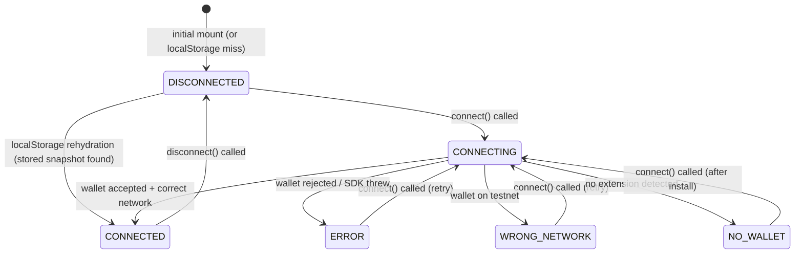

# Wallet Developer Guide

> **See also:** [`WALLET_INTEGRATION_CONTRACT.md`](../WALLET_INTEGRATION_CONTRACT.md) — the integration contract that defines the required wire-up for real Stellar wallet SDKs.

## Overview

The Liquifact wallet subsystem is built around a single-source-of-truth React context (`WalletProvider`) that exposes state and actions to any component via the `useWallet()` hook. This guide documents the state machine, the public hook API, and the rules for integrating new wallet providers.

---

## State Machine

### States

| State | Value | Description |
|---|---|---|
| `DISCONNECTED` | `"disconnected"` | Initial state; no wallet is connected. |
| `CONNECTING` | `"connecting"` | A connection attempt is in progress; UI is locked. |
| `CONNECTED` | `"connected"` | Wallet connected successfully. `walletData` is populated. |
| `ERROR` | `"error"` | Connection attempt failed (user rejection, network error, etc.). |
| `WRONG_NETWORK` | `"wrong_network"` | Wallet is connected but on the wrong Stellar network. |
| `NO_WALLET` | `"no_wallet"` | No compatible Stellar wallet extension detected in the browser. |

### Transition Diagram



### Transition Triggers

| From | To | Trigger |
|---|---|---|
| `DISCONNECTED` | `CONNECTING` | User clicks **Connect Wallet** |
| `DISCONNECTED` | `CONNECTED` | Page reload with valid `localStorage` snapshot |
| `CONNECTING` | `CONNECTED` | SDK resolves with valid address + correct network |
| `CONNECTING` | `ERROR` | SDK throws or user cancels permission dialog |
| `CONNECTING` | `WRONG_NETWORK` | SDK resolves but network ≠ `"public"` |
| `CONNECTING` | `NO_WALLET` | No wallet extension found in `window` |
| `CONNECTED` | `DISCONNECTED` | User clicks **Disconnect** |
| `ERROR` | `CONNECTING` | User clicks **Retry** |
| `WRONG_NETWORK` | `CONNECTING` | User clicks **Switch Network** (retries after manual switch) |
| `NO_WALLET` | `CONNECTING` | User clicks **Install Wallet** CTA, then retries |

### Persistence Rules

Only the `CONNECTED` state is written to `localStorage` (key: `liquifact-wallet-snapshot`). All other states clear the snapshot.

```
CONNECTED    → write snapshot  { version, state, address (truncated), network }
DISCONNECTED → clear snapshot
ERROR        → clear snapshot
WRONG_NETWORK→ clear snapshot
CONNECTING   → no-op (not persisted)
NO_WALLET    → no-op (not persisted)
```

> **Security:** Never persist balances, private keys, or full signing material. The snapshot stores only the first 4 and last 6 characters of the address (e.g. `GABC...XYZ123`). Addresses starting with `S` and ≥ 56 characters long (secret keys) are rejected outright.

---

## Public Hook API — `useWallet()`

Defined in [`components/WalletProvider.jsx`](../components/WalletProvider.jsx). Must be called inside a `<WalletProvider>` tree, otherwise it throws.

```js
import { useWallet } from '@/components/WalletProvider';

const { state, walletData, connect, disconnect } = useWallet();
```

### Return Shape

```ts
{
  /** One of the WALLET_STATES string values */
  state: string;

  /**
   * Populated only in CONNECTED state.
   * balance is runtime-only and is never persisted.
   */
  walletData: {
    address: string;   // truncated Stellar G-address, e.g. "GABC...XYZ123"
    network: string;   // "public" | "testnet"
    balance?: string;  // e.g. "1,234.56 XLM" — live only, never stored
  } | null;

  /**
   * Initiate a wallet connection.
   * Returns a settled promise — never rejects; errors are
   * surfaced through the outcome field and the state machine.
   */
  connect: () => Promise<{
    outcome: 'success' | 'error' | 'wrong_network' | 'no_wallet';
    message?: string;
  }>;

  /**
   * Terminate the session, reset state to DISCONNECTED,
   * and remove the persisted snapshot.
   */
  disconnect: () => void;
}
```

### `WALLET_STATES` Constant

```js
import { WALLET_STATES } from '@/components/WalletProvider';

WALLET_STATES.DISCONNECTED   // "disconnected"
WALLET_STATES.CONNECTING     // "connecting"
WALLET_STATES.CONNECTED      // "connected"
WALLET_STATES.ERROR          // "error"
WALLET_STATES.WRONG_NETWORK  // "wrong_network"
WALLET_STATES.NO_WALLET      // "no_wallet"
```

Always compare against this constant rather than raw strings to stay in sync with future state renames.

---

## Utility Exports

These helpers are exported from `WalletProvider.jsx` for use in tests and real SDK adapters:

| Function | Signature | Description |
|---|---|---|
| `truncateAddress` | `(address: string) => string` | Returns first 4 + last 6 chars with `...` in between. Safe for display and persistence. |
| `sanitizeSnapshot` | `(raw: unknown) => Snapshot \| null` | Validates a raw JSON object from storage. Rejects wrong version, non-persistable states, bad address format, and secret keys. |
| `isBrowser` | `() => boolean` | Returns `true` when `window` is defined (guards SSR code paths). |
| `readStoredSnapshot` | `() => Snapshot \| null` | Reads and sanitizes `localStorage`. Safe to call in SSR — returns `null` on the server. |
| `writeStoredSnapshot` | `(state, walletData) => void` | Writes the snapshot for `CONNECTED` state; otherwise delegates to `clearStoredSnapshot`. |
| `clearStoredSnapshot` | `() => void` | Removes `liquifact-wallet-snapshot` from storage. |

---

## Component Architecture

```
app/layout.js
└── <ToastProvider>
    └── <WalletProvider>        ← single source of truth, mounted once
        └── <NavMenu>
            └── <WalletStatusLazy>   ← next/dynamic, ssr: false
                └── <WalletStatus>   ← presentational consumer
```

- **`WalletProvider`** manages state, persistence, and toast notifications.  
- **`WalletStatusLazy`** lazy-loads `WalletStatus` with `ssr: false` to prevent "window is not defined" errors when the Stellar SDK initialises, and renders a pulse-skeleton placeholder to prevent CLS.  
- **`WalletStatus`** is a pure presentational component. It calls `useWallet()` to read state and dispatch actions. It includes an inline error banner (`role="alert"`, `aria-live="assertive"`) that persists as long as the wallet is in `ERROR` or `WRONG_NETWORK`.

---

## Error Feedback Layers

When the state machine enters `ERROR` or `WRONG_NETWORK`:

1. **Toast** — immediate, auto-dismissing notification via `ToastProvider`.  
2. **Inline banner** — persistent `role="alert"` block rendered above the wallet button until the state transitions away.  
3. **`sr-only` status region** — `role="status"` `aria-live="polite"` announces transitions to screen readers without duplicating visible text.

---

## Implementing a Real Wallet Adapter

Replace the mock `setTimeout` block in `WalletProvider.connect` with real SDK calls. The required outcome contract is:

```js
// Must resolve (never reject) with one of:
resolve({ outcome: 'success' });
resolve({ outcome: 'error',         message: 'Human-readable reason' });
resolve({ outcome: 'wrong_network', message: 'Human-readable reason' });
resolve({ outcome: 'no_wallet',     message: 'Human-readable reason' });
```

See [`WALLET_INTEGRATION_CONTRACT.md § Required Implementation`](../WALLET_INTEGRATION_CONTRACT.md#required-implementation) for the full checklist (detection, connection, network verification, error handling).

### Deprecated Shim

`components/WalletContext.jsx` is a backwards-compat re-export. Do **not** add new code there. All imports should target `@/components/WalletProvider` directly.

---

## Testing

| Test file | Focus |
|---|---|
| `WalletProvider.test.tsx` | Unit: state transitions, localStorage persistence |
| `WalletProvider.consolidation.test.tsx` | Integration: provider + consumer render |
| `WalletStatus.test.jsx` / `.test.tsx` | UI: button labels, ARIA, error banner lifecycle |
| `WalletStatus.lazy.test.tsx` | Lazy loading, placeholder, CLS guard |
| `WalletContext.test.jsx` | Shim re-exports nothing new |

Run the wallet test suite in isolation:

```bash
npx jest --testPathPattern="Wallet"
```
